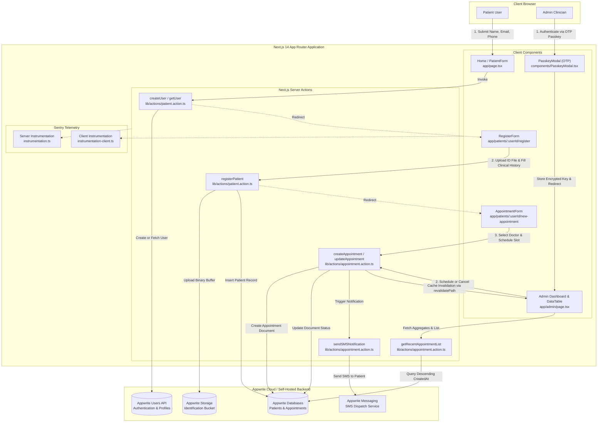

# CarePulse — Healthcare Patient Management System

[](https://github.com/SpEXterXD/Patient-MGMT)
[](https://nextjs.org/)
[](https://www.typescriptlang.org/)
[](https://appwrite.io/)
[](https://tailwindcss.com/)
[](https://sentry.io/)
[](LICENSE)

> A modern, HIPAA-conscious healthcare scheduling and administrative platform designed to streamline patient intake, automate appointment workflows, and deliver real-time SMS status dispatching.

CarePulse eliminates manual paperwork and communication friction in clinical settings by providing patients with an intuitive digital registration and scheduling flow, paired with a secure, passkey-protected administrative command center for healthcare providers to review, confirm, and cancel appointments with automated SMS alerts.

---

## Table of Contents

- [Key Features](#key-features)
- [Architecture & Tech Stack](#architecture--tech-stack)
  - [Technology Matrix](#technology-matrix)
  - [System Architecture Flow](#system-architecture-flow)
- [Project Structure](#project-structure)
- [Prerequisites & System Requirements](#prerequisites--system-requirements)
- [Quickstart / Installation](#quickstart--installation)
  - [1. Clone Repository](#1-clone-repository)
  - [2. Install Dependencies](#2-install-dependencies)
  - [3. Configure Environment Variables](#3-configure-environment-variables)
  - [4. Set Up Appwrite Infrastructure](#4-set-up-appwrite-infrastructure)
  - [5. Run Development Server](#5-run-development-server)
- [Configuration & Environment Variables](#configuration--environment-variables)
- [Usage & API Reference](#usage--api-reference)
  - [Core User Journeys](#core-user-journeys)
  - [Server Actions Reference](#server-actions-reference)
  - [API Route Handlers](#api-route-handlers)
- [Testing & Quality Assurance](#testing--quality-assurance)
- [Contributing & License](#contributing--license)

---

## Key Features

- **Multi-Step Patient Intake & Onboarding:**
  - Initial contact creation with name, email, and internationalized E.164 phone formatting (`react-phone-number-input`).
  - Comprehensive medical profile intake: demographics, identification documents, insurance details, allergies, current medications, family/past medical history, and required HIPAA consent checkboxes.
- **Document Identification Streaming:**
  - Secure drag-and-drop identification document upload (`react-dropzone`).
  - Server-side binary buffer streaming to Appwrite Storage via `node-appwrite/file` without exposing storage keys to the client.
- **Dynamic Physician & Appointment Scheduling:**
  - Doctor selection mapped against active clinical staff with custom visual avatars.
  - Interactive date and time picker (`react-datepicker`) with customizable appointment time windows.
  - Request confirmation screen displaying doctor attribution and scheduled timestamps.
- **Passkey-Gated Administrative Command Center:**
  - 6-digit OTP modal (`input-otp`) verification using `NEXT_PUBLIC_ADMIN_PASSKEY`.
  - Base64 client-side credential persistence in `localStorage` for administrative session continuity.
- **Operational Status Metrics & Tabular Management:**
  - Summary stat cards displaying real-time aggregate totals for scheduled, pending, and cancelled consultations.
  - Searchable, paginated TanStack table (`@tanstack/react-table`) with custom status pill badges (`scheduled`, `pending`, `cancelled`).
- **Automated SMS Dispatch via Appwrite Messaging:**
  - Real-time SMS notifications dispatched to patients upon appointment confirmation or cancellation containing assigned doctor details or clinical cancellation rationale.
- **End-to-End Observability & Error Monitoring:**
  - Full-stack Sentry telemetry configured across Node.js, Edge runtime, and browser client layers with distributed tracing and automatic router transition tracking.

---

## Architecture & Tech Stack

### Technology Matrix

| Layer | Technology | Version | Description |
| :--- | :--- | :--- | :--- |
| **Runtime** | Node.js | `>= 18.17.0` (LTS 20.x+ recommended) | Server runtime execution environment |
| **Framework** | Next.js (App Router) | `14.2.5` | Hybrid React Server Components (RSC) and Server Actions |
| **Language** | TypeScript | `^5.0.0` | Strict static typing and interface definitions |
| **Backend as a Service** | Appwrite (`node-appwrite`) | `^14.1.0` | Authentication/Users, NoSQL Database, Storage, and Messaging SDK |
| **Styling & Design** | Tailwind CSS | `^3.4.1` | Utility-first CSS configured with custom dark-mode healthcare palette |
| **Component Primitives** | Radix UI | Various | Accessible primitives (Dialog, Select, Dropdown, Radio, Checkbox) |
| **Form Management** | React Hook Form & Zod | `^7.52.2` / `^3.23.8` | Performant form state validation and schema resolution |
| **Data Tables** | TanStack Table | `^8.21.3` | Headless, accessible tabular data management and pagination |
| **Input Handling** | Input OTP & React Dropzone | `^1.4.2` / `^14.3.5` | 6-digit PIN verification and drag-and-drop file ingestion |
| **Observability** | `@sentry/nextjs` | `^9.40.0` | Server, Client, and Edge performance and error tracking |

### System Architecture Flow



---

## Project Structure

```text
Patient-MGMT/
├── app/                                  # Next.js 14 App Router Directory
│   ├── admin/                            # Administrative Portal
│   │   └── page.tsx                      # Admin dashboard with stat cards and TanStack table
│   ├── api/                              # Route Handlers
│   │   └── sentry-example-api/           # Diagnostic endpoint for Sentry telemetry verification
│   │       └── route.ts                  # Forced backend exception route
│   ├── patients/                         # Patient Dynamic Routing
│   │   └── [userId]/                     # User-scoped segment
│   │       ├── new-appointment/          # Appointment creation flow
│   │       │   ├── page.tsx              # Appointment booking form page
│   │       │   └── success/              # Booking confirmation view
│   │       │       └── page.tsx          # Appointment confirmation and doctor details
│   │       └── register/                 # Comprehensive clinical intake flow
│   │           └── page.tsx              # Patient registration and document upload
│   ├── global-error.tsx                  # Root Next.js error boundary reporting to Sentry
│   ├── globals.css                       # Global styles, Tailwind directives, and custom utility classes
│   ├── layout.tsx                        # Root layout wrapping application with ThemeProvider & fonts
│   └── page.tsx                          # Root landing page (Patient sign-in & Admin modal trigger)
├── components/                           # Reusable UI & Domain Components
│   ├── forms/                            # React Hook Form form implementations
│   │   ├── AppointmentForm.tsx           # Appointment create, schedule, and cancellation form
│   │   ├── PatientForm.tsx               # Initial onboarding user identification form
│   │   └── RegisterForm.tsx              # In-depth medical and identification intake form
│   ├── table/                            # Tabular Display System
│   │   ├── columns.tsx                   # Column definitions for TanStack table
│   │   └── DataTable.tsx                 # Paginated TanStack data table component
│   ├── ui/                               # Radix UI + shadcn/ui headless design primitives
│   │   ├── alert-dialog.tsx              # Modal dialog primitives
│   │   ├── button.tsx                    # Design system button component
│   │   ├── checkbox.tsx                  # Accessible checkbox primitive
│   │   ├── dialog.tsx                    # Modal dialog overlays and content
│   │   ├── dropdown-menu.tsx             # Popover dropdown navigation
│   │   ├── form.tsx                      # React Hook Form context wrappers
│   │   ├── input-otp.tsx                 # 6-digit OTP / PIN input controller
│   │   ├── input.tsx                     # Standard text input element
│   │   ├── label.tsx                     # Form field accessible labels
│   │   ├── radio-group.tsx               # Radio select options
│   │   ├── select.tsx                    # Select menu primitives
│   │   ├── table.tsx                     # HTML table primitive wrappers
│   │   └── textarea.tsx                  # Multiline text input
│   ├── AppointmentModal.tsx              # Dialog container for scheduling and cancelling appointments
│   ├── CustomFormField.tsx               # Polymorphic form field renderer (Inputs, Selects, Dates, OTP)
│   ├── FileUploader.tsx                  # React-dropzone identification file uploader
│   ├── PasskeyModal.tsx                  # Administrative 6-digit PIN gatekeeper modal
│   ├── StatCard.tsx                      # Summary KPI statistic card with custom status iconography
│   ├── StatusBadge.tsx                   # Color-coded pill badge (Scheduled, Pending, Cancelled)
│   ├── SubmitButton.tsx                  # Loading-state button with spinner support
│   └── theme-component.tsx               # next-themes Dark Mode ThemeProvider wrapper
├── constants/                            # Static Configuration & Domain Constants
│   └── index.ts                          # Doctor roster, identification types, form defaults, status icons
├── lib/                                  # Core Library, Utilities, and Server-Side Operations
│   ├── actions/                          # Next.js Server Actions ('use server')
│   │   ├── appointment.action.ts         # Appointment mutations, queries, and SMS dispatching
│   │   └── patient.action.ts             # User creation, patient registration, and file upload actions
│   ├── appwrite.config.ts                # Appwrite SDK client, databases, storage, and users instantiation
│   ├── utils.ts                          # Tailwind merge (cn), date formatting, and key cipher utilities
│   └── validation.ts                     # Zod schemas for user, patient, and appointment validation
├── public/                               # Static Static Assets
│   └── assets/                           # SVG icons, physician avatars, background vectors, and GIFs
├── types/                                # Ambient TypeScript Declarations
│   ├── appwrite.types.ts                 # Strongly typed Models.Document extensions (Patient, Appointment)
│   └── index.d.ts                        # Form parameter types, Gender, Status, and search param interfaces
├── .env.example                          # Environment variable template
├── .eslintrc.json                        # ESLint configuration
├── components.json                       # shadcn/ui configuration manifest
├── instrumentation-client.ts             # Sentry client initialization & router transition tracking
├── instrumentation.ts                    # Next.js Server & Edge Sentry instrumentation hook
├── next.config.mjs                       # Next.js bundler config wrapped with Sentry Webpack Plugin
├── package.json                          # Project dependencies, scripts, and runtime engines
├── postcss.config.mjs                    # PostCSS plugins configuration
├── sentry.edge.config.ts                 # Sentry Edge runtime tracing configuration
├── sentry.server.config.ts               # Sentry Node.js server tracing configuration
├── tailwind.config.ts                    # Tailwind CSS configuration with customized theme extensions
└── tsconfig.json                         # TypeScript compiler options and path aliases (@/*)
```

---

## Prerequisites & System Requirements

Before running the application locally, ensure your environment meets the following specifications:

- **Node.js:** `v18.17.0` or higher (Active LTS `v20.x` or `v22.x` strongly recommended).
- **Package Manager:** `npm` (v9.x+), `pnpm` (v8.x+), or `yarn` (v1.22+).
- **Appwrite Account:** An active instance of [Appwrite Cloud](https://cloud.appwrite.io/) or a self-hosted Appwrite server (`v1.4+` or `v1.5+`).
- **Sentry Account (Optional):** Sentry project DSN for client/server error telemetry.

---

## Quickstart / Installation

### 1. Clone Repository

```bash
git clone https://github.com/SpEXterXD/Patient-MGMT.git
cd Patient-MGMT
```

### 2. Install Dependencies

```bash
npm install
```

### 3. Configure Environment Variables

Create a local environment configuration file from the provided `.env.example` template:

```bash
cp .env.example .env.local
```

Open `.env.local` and populate the keys with your Appwrite project credentials and administrative passkey:

```env
NEXT_PUBLIC_ENDPOINT=https://cloud.appwrite.io/v1
PROJECT_ID=your_appwrite_project_id
API_KEY=your_appwrite_secret_api_key
DATABASE_ID=your_appwrite_database_id
PATIENT_COLLECTION_ID=your_patient_collection_id
APPOINTMENT_COLLECTION_ID=your_appointment_collection_id
DOCTOR_COLLECTION_ID=your_doctor_collection_id
NEXT_PUBLIC_BUCKET_ID=your_storage_bucket_id
NEXT_PUBLIC_ADMIN_PASSKEY=123456
```

### 4. Set Up Appwrite Infrastructure

Within your Appwrite Console, establish the required database collections and storage bucket:

#### A. Database & Collections
Create a Database (`DATABASE_ID`), and add two collections:

1. **Patients Collection (`PATIENT_COLLECTION_ID`):**
   - Attributes:
     - `userId` (String, size: 36, required)
     - `name` (String, size: 100, required)
     - `email` (String, size: 255, required)
     - `phone` (String, size: 20, required)
     - `birthDate` (Datetime, required)
     - `gender` (Enum: `male`, `female`, `other`, required)
     - `address` (String, size: 500, required)
     - `occupation` (String, size: 500, required)
     - `emergencyContactName` (String, size: 100, required)
     - `emergencyContactNumber` (String, size: 20, required)
     - `primaryPhysician` (String, size: 100, required)
     - `insuranceProvider` (String, size: 100, required)
     - `insurancePolicyNumber` (String, size: 100, required)
     - `allergies` (String, size: 1000, optional)
     - `currentMedication` (String, size: 1000, optional)
     - `familyMedicalHistory` (String, size: 1000, optional)
     - `pastMedicalHistory` (String, size: 1000, optional)
     - `identificationType` (String, size: 100, optional)
     - `identificationNumber` (String, size: 100, optional)
     - `identificationDocumentId` (String, size: 100, optional)
     - `identificationDocumentUrl` (String, size: 1000, optional)
     - `privacyConsent` (Boolean, required)
   - Indexes:
     - `userId_idx` on attribute `userId` (Key: Unique or Key)

2. **Appointments Collection (`APPOINTMENT_COLLECTION_ID`):**
   - Attributes:
     - `patient` (Relationship with Patients collection or String Document ID, required)
     - `schedule` (Datetime, required)
     - `status` (Enum: `pending`, `scheduled`, `cancelled`, required)
     - `primaryPhysician` (String, size: 100, required)
     - `reason` (String, size: 1000, required)
     - `note` (String, size: 1000, optional)
     - `userId` (String, size: 36, required)
     - `cancellationReason` (String, size: 1000, optional)
   - Indexes:
     - Order index on `$createdAt` (Type: Key, Attribute: `$createdAt`, Order: `DESC`)

#### B. Storage Bucket (`NEXT_PUBLIC_BUCKET_ID`)
- Create a bucket named `identification_documents`.
- Allowed file extensions: `png`, `jpg`, `jpeg`, `gif`, `svg`, `pdf`.
- Set file size limits according to your clinical requirements (e.g., max 5MB).

#### C. API Key Scopes
When generating the `API_KEY` under **Project Settings > API Keys**, grant the following scopes:
- `databases.read`, `databases.write`
- `users.read`, `users.write`
- `storage.read`, `storage.write`
- `messaging.read`, `messaging.write`

### 5. Run Development Server

```bash
npm run dev
```

The application will be accessible at:
- **Patient Portal:** [http://localhost:3000](http://localhost:3000)
- **Admin Verification Portal:** [http://localhost:3000/?admin=true](http://localhost:3000/?admin=true)
- **Admin Command Dashboard:** [http://localhost:3000/admin](http://localhost:3000/admin)

---

## Configuration & Environment Variables

| Variable | Type | Required / Optional | Default | Description |
| :--- | :--- | :--- | :--- | :--- |
| `NEXT_PUBLIC_ENDPOINT` | `string` (URL) | **Required** | `https://cloud.appwrite.io/v1` | Appwrite REST API gateway endpoint URL. |
| `PROJECT_ID` | `string` | **Required** | — | Unique identifier for your Appwrite project. |
| `API_KEY` | `string` (Secret) | **Required** | — | Appwrite server-side administrative API key with database, user, and messaging privileges. |
| `DATABASE_ID` | `string` | **Required** | — | Unique identifier for the Appwrite database containing clinical collections. |
| `PATIENT_COLLECTION_ID` | `string` | **Required** | — | Appwrite Collection ID storing registered patient medical records. |
| `APPOINTMENT_COLLECTION_ID` | `string` | **Required** | — | Appwrite Collection ID storing scheduled and historical appointments. |
| `DOCTOR_COLLECTION_ID` | `string` | Optional | — | Configured in Appwrite client binding for custom doctor rosters (falls back to `constants/index.ts`). |
| `NEXT_PUBLIC_BUCKET_ID` | `string` | **Required** | — | Appwrite Storage Bucket ID where patient identity documents are uploaded. |
| `NEXT_PUBLIC_ADMIN_PASSKEY` | `string` (6 Digits)| **Required** | `123456` | Numeric 6-digit access code for admin dashboard gatekeeper validation. |
| `CI` | `boolean` | Optional | — | Build environment indicator. When true, enables verbose Sentry sourcemap upload logs. |
| `SENTRY_AUTH_TOKEN` | `string` (Secret) | Optional | — | Authentication token for Sentry CLI when uploading release artifacts and source maps. |

---

## Usage & API Reference

### Core User Journeys

1. **Patient Self-Registration Flow:**
   - Patient visits `/` and inputs Name, Email, and Phone.
   - Form submission invokes `createUser`. If an existing user matches the email, the existing account is retrieved (`409 Conflict` resolution).
   - Patient is routed to `/patients/[userId]/register` to complete medical profile details, upload photo ID, and submit HIPAA consents.
   - The file is converted into a binary buffer, uploaded to Appwrite Storage via `InputFile.fromBuffer()`, and the patient record is persisted in Appwrite Databases.
2. **Appointment Scheduling Flow:**
   - Navigating to `/patients/[userId]/new-appointment` loads the patient document via `getPatient(userId)`.
   - Patient selects an attending physician from the roster (`John Green`, `Leila Cameron`, `David Livingston`, etc.), selects a date/time, and describes consultation reasons.
   - Upon submission (`createAppointment`), the record is saved with status `pending`, and the patient is redirected to `/patients/[userId]/new-appointment/success?appointmentId=[id]`.
3. **Administrative Triage Flow:**
   - Admin accesses `/?admin=true`, entering the 6-digit passkey in `PasskeyModal`.
   - The passkey is matched against `NEXT_PUBLIC_ADMIN_PASSKEY`, base64 encrypted, saved to `localStorage`, and the admin is routed to `/admin`.
   - The admin views live metrics and the TanStack appointment table.
   - Clicking **Schedule** opens `AppointmentModal` (type: `schedule`), allowing date assignment and physician confirmation.
   - Clicking **Cancel** opens `AppointmentModal` (type: `cancel`), requiring a cancellation reason.
   - Submitting updates the document, invalidates `/admin` cache via `revalidatePath('/admin')`, and triggers an SMS alert to the patient.

### Server Actions Reference

All Server Actions reside under `lib/actions/` and are executed strictly on the Node.js runtime.

#### 1. Patient Actions (`lib/actions/patient.action.ts`)

- **`createUser(user: CreateUserParams): Promise<Models.User<Models.Preferences>>`**
  ```typescript
  import { createUser } from "@/lib/actions/patient.action";

  const user = await createUser({
    name: "Alex Mercer",
    email: "alex.mercer@example.com",
    phone: "+15551234567"
  });
  ```
- **`getUser(userId: string): Promise<User>`**
  - Fetches the Appwrite user profile document matching `userId`.
- **`getPatient(userId: string): Promise<Patient>`**
  - Queries `PATIENT_COLLECTION_ID` where `userId == [userId]`.
- **`registerPatient({ identificationDocument, ...patient }: RegisterUserParams): Promise<Patient>`**
  - Reads `identificationDocument` FormData, converts binary stream via `InputFile.fromBuffer`, creates file in `NEXT_PUBLIC_BUCKET_ID`, and creates patient document in `PATIENT_COLLECTION_ID`.

#### 2. Appointment Actions (`lib/actions/appointment.action.ts`)

- **`createAppointment(appointment: CreateAppointmentParams): Promise<Appointment>`**
  - Creates a new appointment document in `APPOINTMENT_COLLECTION_ID` with status `pending`.
- **`getAppointment(appointmentId: string): Promise<Appointment>`**
  - Retrieves a specific appointment document by its document ID.
- **`getRecentAppointmentList(): Promise<{ totalCount: number, scheduledCount: number, pendingCount: number, cancelledCount: number, documents: Appointment[] }>`**
  - Queries appointments sorted by `$createdAt` descending and computes metric count aggregates.
- **`updateAppointment({ appointmentId, userId, appointment, type }: UpdateAppointmentParams): Promise<Appointment>`**
  - Updates appointment fields in the database, sends an SMS notification via `sendSMSNotification`, and revalidates the `/admin` path cache.
- **`sendSMSNotification(userId: string, content: string): Promise<Models.Message>`**
  - Dispatches an SMS message through Appwrite Messaging targeting the provided `userId`.

### API Route Handlers

#### Diagnostic Sentry Route
- **Path:** `/api/sentry-example-api`
- **Method:** `GET`
- **Description:** Raises a synthetic `SentryExampleAPIError` to verify Sentry server-side exception capturing and telemetry ingestion.

**Example Request:**
```bash
curl -X GET http://localhost:3000/api/sentry-example-api
```

---

## Testing & Quality Assurance

### Static Analysis & Linting

Run ESLint to identify syntax errors, styling discrepancies, and React Hooks rule violations:

```bash
npm run lint
```

### Type Checking

Perform TypeScript strict static type checking without emitting build artifacts:

```bash
npx tsc --noEmit
```

### Production Build Verification

Compile and bundle the production Next.js application to validate Server Components, Sentry webpack transformations, and App Router static/dynamic pages:

```bash
npm run build
```

To run the compiled production bundle locally:

```bash
npm run start
```

---

## Contributing & License

### Contribution Workflow

1. **Fork the Repository** on GitHub.
2. **Create a Feature Branch:**
   ```bash
   git checkout -b feature/clinical-enhancement
   ```
3. **Commit Changes** following conventional commit guidelines:
   ```bash
   git commit -m "feat(appointments): add calendar conflict checking"
   ```
4. **Push to the Branch:**
   ```bash
   git push origin feature/clinical-enhancement
   ```
5. **Open a Pull Request** against the `main` branch with detailed reproduction steps and test verification.

### License

This project is currently marked as **Private** (`"private": true` in `package.json`) and is proprietary. All rights reserved. 

If this codebase is open-sourced in the future, standard licensing (e.g., [MIT License](https://opensource.org/licenses/MIT)) will apply.